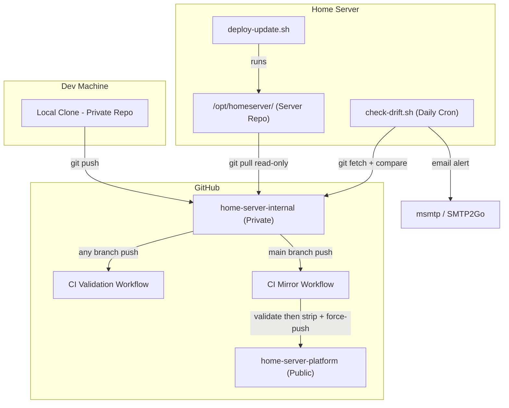

# DevOps Workflow — Two-Repo Git Model

## Overview

This project uses a two-repo Git model for deployment and public sharing:

- **Private repo** — source of truth for all development (scripts, specs, operational context)
- **Public repo** — sanitized community mirror (scripts, example configs, generic docs)
- **Server** — pulls from private repo via read-only deploy key

## Architecture



### Data Flow

```
Developer pushes → Private Repo → CI validates → CI mirrors to Public Repo
                                              ↓
                        Server pulls (manual) ← Private Repo (deploy key, read-only)
                                              ↓
                        Drift check (daily cron) compares HEAD vs origin/main
```

## Git-Pull Deployment

The server uses `git pull` instead of SCP for deployments:

1. Develop and test locally
2. Push to private repo
3. CI validates (tests + governance)
4. On server: `bash scripts/operations/utils/deploy-update.sh`
5. Script runs `git pull origin main` and reports deployed commit

The server has a read-only deploy key — it can pull but never push.

## Drift Detection

The drift check script (`scripts/operations/monitoring/check-drift.sh`) detects when the server diverges from the repo:

- **Commits behind** — server hasn't pulled latest changes
- **Local modifications** — files edited directly on server
- **Untracked files** — new files in `scripts/` or `configs/` not in repo
- **Detached HEAD** — server not on `main` branch

### Modes

| Mode | Usage | Behavior |
|------|-------|----------|
| Default | Cron (daily 08:00) | Full checks + email alert on drift |
| `--warn-only` | Deploy script headers | Print warnings, no email, never blocks |

### Cron Schedule

| Time | Job |
|------|-----|
| 02:00 | backup-all.sh |
| */15 min | check-container-health.sh |
| 06:00 | watchdog.sh |
| 08:00 | check-drift.sh |

## CI Pipeline

On every push to any branch:

1. Run CI-safe tests (`bash tests/run-all.sh --ci`)
2. Shellcheck lint all `.sh` files (`shellcheck -S warning`)
3. Validate governance (script size limits)
4. Gitleaks secret scan

## CI Mirror

On every push to `main` in the private repo:

1. CI runs tests and governance validation
2. If CI passes, mirror workflow strips private-only files from entire history
3. Sanitized content is force-pushed to public repo

Private-only files (never in public repo): `.kiro/`, `.gitleaks.toml`, `input/`, `.github/`

## Fork User Setup

Fork users can use drift detection out of the box:

1. Fork the public repo on GitHub
2. Clone to server: `git clone git@github.com:<user>/<fork>.git /opt/homeserver`
3. Copy cron file: `sudo cp configs/cron/homeserver-cron /etc/cron.d/`
4. Drift check alerts when server falls behind `origin/main`

No code changes needed — the script compares local HEAD against whatever `origin` points to.

## Multi-Machine Development

Clone the private repo on any dev machine to get the full environment:

```bash
git clone git@github.com:<user>/<private-repo>.git
```

All scripts, specs, docs, and operational context are in one place. No manual file syncing.

## Local Branch Protection

Git hooks block direct commits and pushes to `main`, enforcing a feature-branch workflow.

Install hooks (run once per clone):

```bash
bash scripts/operations/utils/install-git-hooks.sh
```

This installs:
- `pre-commit`: blocks commits on `main` + shellcheck lint on staged `.sh` files
- `pre-push`: blocks pushes to `main`

Shellcheck runs at `-S warning` severity on staged `.sh` files only. If shellcheck is not installed, it prints a warning and continues. Install with `brew install shellcheck` (macOS) or `apt install shellcheck` (Ubuntu).

Workflow: create a feature branch, commit there, push, open a PR. CI validates before merge.

Bypass when needed: `git commit --no-verify` or `git push --no-verify`
